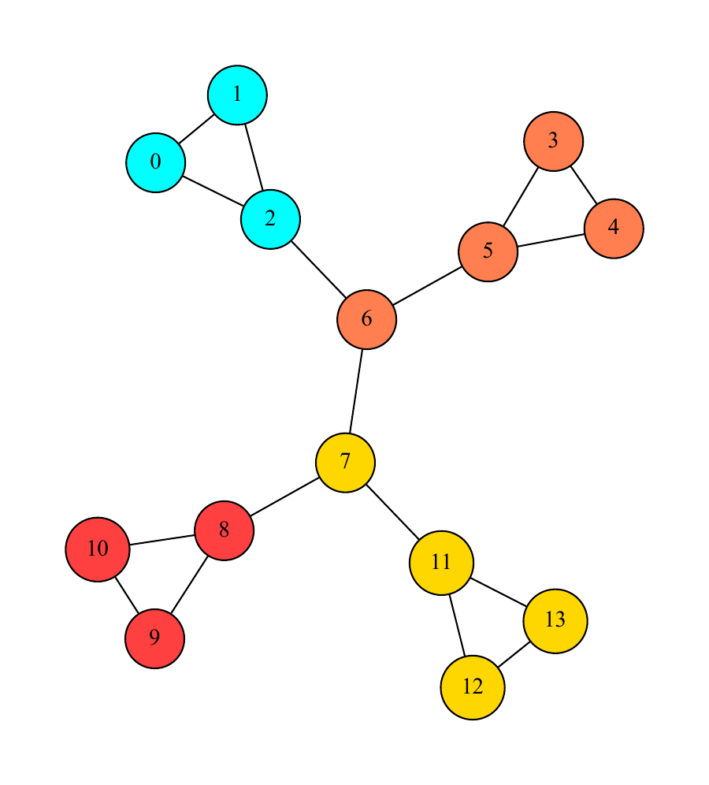
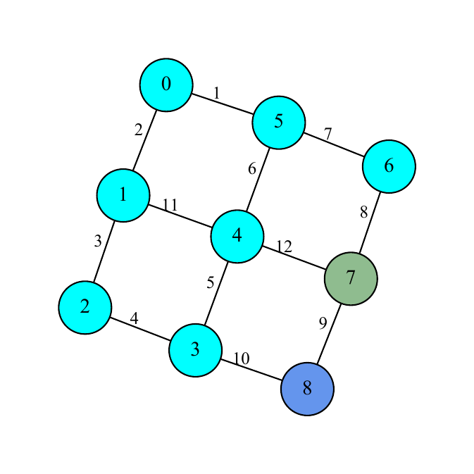
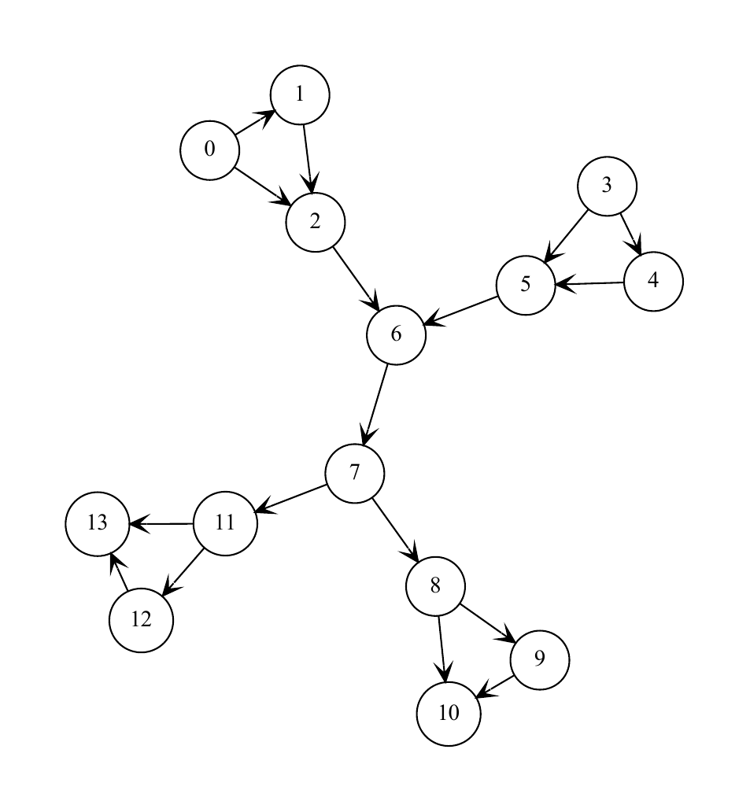

# JGraphT Graphviz Wrapper

A lightweight Java wrapper for exporting [JGraphT](https://jgrapht.org/) graphs to [Graphviz](https://graphviz.org/) DOT files and generating rendered graph output through Graphviz layout engines.

The project is intended as a small bridge between JGraphT and Graphviz, combining their capabilities to quickly produce graph visualizations for experimentation and use in other projects.

It supports directed and undirected graphs, weighted edges, optional cluster visualization, configurable DOT properties, and several Graphviz layout engines.

## Overview
Simple wrapper built to quickly produce renders for generated graphs & clusters used as tests on my overlapping community detection project using JGraphT and Graphviz.


Credits to Graphviz & JGraphT developers for making this combination possible. 

## Features

- Export JGraphT graphs to **DOT** format
- Render DOT files using Graphviz from the command line
- Generate output such as **PDF**
- Support for:
  - Directed and undirected graphs
  - Weighted and unweighted graphs
  - Graph clusters / community groupings
  - Custom vertex and edge Graphviz properties
  - Cluster-specific colors
- Supports multiple Graphviz layout engines:
  - `dot`
  - `neato`
  - `twopi`
  - `circo`
  - `fdp`
  - `sfdp`
  - `osage`
  - `patchwork`
- Weighted edges are exported with their edge weights as labels
- Disconnected vertices are preserved in the generated DOT file

## How It Works

The wrapper exposes two main operations:

1. **Export a JGraphT graph to DOT**
2. **Execute a Graphviz layout engine to render the DOT file**

This keeps graph construction and graph visualization separate: JGraphT remains responsible for representing the graph, while Graphviz handles layout and rendering.

## Usage

### Export a graph to DOT

For a standard JGraphT graph:

```java
JGraphTGraphVizWrapper.createGraphDOTFile(
        "simple_graph.dot",
        graph,
        "shape=circle",
        JGraphTGraphVizWrapper.DEFAULT_PROPERTIES
);
```

This creates a DOT file containing the graph structure and the supplied Graphviz vertex/edge properties.

### Render a DOT file

Once the DOT file has been generated, it can be rendered using one of the supported Graphviz layout engines:

```java
JGraphTGraphVizWrapper.printGraph(
        "neato",
        "-Goverlap=false",
        "simple_graph.dot",
        "pdf",
        "simple_graph"
);
```

The resulting file is:

```text
simple_graph.pdf
```

The output extension is automatically appended from the requested output type.

## Graph Properties

Graphviz properties can be supplied independently for vertices and edges.

For example:

```java
JGraphTGraphVizWrapper.createGraphDOTFile(
        "directed_graph.dot",
        graph,
        "shape=circle",
        "arrowhead=vee"
);
```

These properties are written directly into the corresponding DOT declarations.

The same mechanism can be used for Graphviz attributes such as:

```text
shape=circle
style=filled
fontsize=12
arrowhead=vee
```

## Weighted Graphs

Weighted JGraphT graphs are supported automatically.

When the graph is marked as weighted, edge weights are exported as Graphviz edge labels:

```text
0 -- 1 [fontsize=12.0, label=2];
```

The current implementation rounds the weight when writing the label.

Example usage:

```java
JGraphTGraphVizWrapper.createGraphDOTFile(
        "weighted_graph.dot",
        weightedGraph,
        "shape=circle",
        JGraphTGraphVizWrapper.DEFAULT_PROPERTIES
);

JGraphTGraphVizWrapper.printGraph(
        "neato",
        "-Goverlap=false",
        "weighted_graph.dot",
        "pdf",
        "weighted_graph"
);
```

## Clusters

The wrapper can also export JGraphT clustering results as Graphviz `subgraph cluster_*` sections.

```java
ClusteringAlgorithm.Clustering<Integer> clustering =
        new GirvanNewmanClustering<>(graph, 4).getClustering();

JGraphTGraphVizWrapper.createGraphDOTFile(
        "simple_graph_clusters.dot",
        graph,
        clustering,
        List.of("aqua", "coral", "gold", "brown1"),
        "shape=circle",
        JGraphTGraphVizWrapper.DEFAULT_PROPERTIES
);
```

Clustered graphs automatically receive `style=filled` so that the supplied cluster colors are visible.

A fixed set of default colors is also provided:

```java
JGraphTGraphVizWrapper.DEFAULT_COLORS
```

The wrapper currently defines ten default colors. If more clusters are supplied than available colors, additional clusters are exported without an assigned fill color.

## Supported Layout Engines

`printGraph()` accepts only the following Graphviz layout engines:

| Engine | Typical use |
| --- | --- |
| `dot` | Hierarchical / directed graphs |
| `neato` | Spring-model layouts |
| `twopi` | Radial layouts |
| `circo` | Circular layouts |
| `fdp` | Force-directed layouts |
| `sfdp` | Large force-directed graphs |
| `osage` | Clustered graphs |
| `patchwork` | Treemap-style layouts |

An unsupported command is rejected instead of being executed.

### Layout arguments

Additional Graphviz arguments can be passed through `algorithmArguments`.

For example:

```java
JGraphTGraphVizWrapper.printGraph(
        "neato",
        "-Goverlap=false",
        "simple_graph.dot",
        "pdf",
        "simple_graph"
);
```

This effectively invokes the corresponding Graphviz command with the supplied arguments and writes the requested output format.

## Examples

### Clustered graph

The wrapper can turn a JGraphT clustering result into a Graphviz visualization with differently colored clusters.



### Weighted graph with clusters

Weighted edges are displayed with their weights while cluster membership is represented through node colors.



### Directed graph

Directed JGraphT graphs are exported using Graphviz's `digraph` syntax, with directional edges.



## Test Files

The repository includes several test programs demonstrating the wrapper with different graph types:

- `SimpleGraphTest`
- `SimpleGraphWithClustersTest`
- `WeightedGraphTest`
- `WeightedGraphWithClustersTest`
- `DirectedGraphTest`

These examples also produce DOT and PDF files that can be used to inspect the generated output.

## Project Structure

```text
.
├── README.md
├── pom.xml
├── assets/
│   ├── directed-graph.png
│   ├── graph-clusters.png
│   └── weighted-graph-clusters.png
└── src/
    ├── main/
    │   └── java/
    │       └── JGraphTGraphVizWrapper.java
    └── test/
        └── java/
            ├── DirectedGraphTest.java
            ├── SimpleGraphTest.java
            ├── SimpleGraphWithClustersTest.java
            ├── WeightedGraphTest.java
            └── WeightedGraphWithClustersTest.java
```

## API Overview

### `createGraphDOTFile`

Exports a graph to a DOT file.

```java
createGraphDOTFile(
    String outputFileName,
    Graph<V, E> graph,
    String vertexProperties,
    String edgeProperties
)
```

An overloaded version additionally accepts clustering information and cluster colors:

```java
createGraphDOTFile(
    String outputFileName,
    Graph<V, E> graph,
    Clustering<V> clustering,
    List<String> clusterColors,
    String vertexProperties,
    String edgeProperties
)
```

### `printGraph`

Executes a supported Graphviz layout engine and generates the requested output:

```java
printGraph(
    String algorithmName,
    String algorithmArguments,
    String dotFileName,
    String outputFileType,
    String outputFileName
)
```

For example, requesting:

```java
outputFileType = "pdf"
outputFileName = "my_graph"
```

produces:

```text
my_graph.pdf
```

## Requirements

- **Java 17+**
- **JGraphT 1.5.1**
- **Graphviz**

The current implementation launches Graphviz through `cmd.exe`, so the Graphviz executable must be available on the system `PATH`.


## Notes

- The wrapper is implemented as a utility-style class and cannot be instantiated.
- Graphviz must be installed separately.
- DOT vertex identifiers are written from the graph's vertex representation, so vertex values should be compatible with Graphviz DOT syntax.
- The current process execution implementation is Windows-specific.